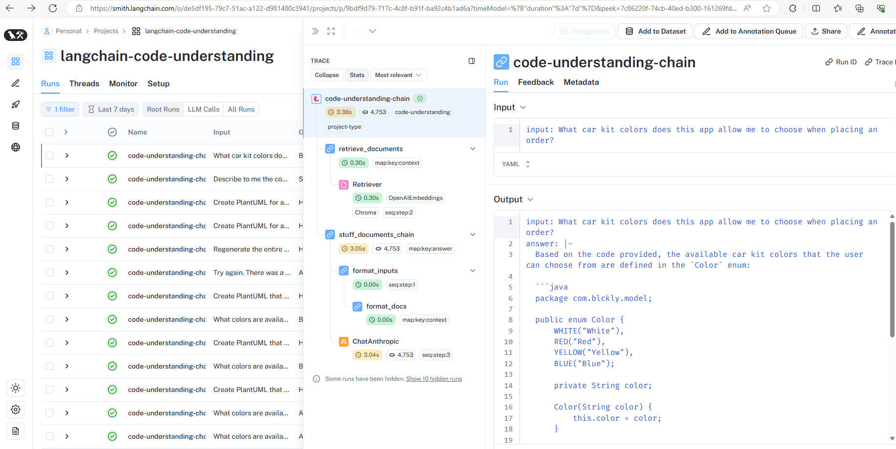

# Langchain and Langsmith Code Example

This repository contains a Python script that integrates various Langchain and Langsmith tools to provide a robust question-answering system based on dynamic content retrieval from a specified Git repository. The code showcases how to clone a repository, parse documents, split texts, create a searchable database, and build a question-answering chain using different language models.

## Features

- **Git Repository Cloning**: Automatically clones a Git repository to a local directory for content analysis.
- **Document Loading and Parsing**: Uses the `GenericLoader` and `LanguageParser` to load and parse documents from the cloned repository.
- **Text Splitting**: Implements a `RecursiveCharacterTextSplitter` for dividing documents into manageable chunks.
- **Database and Retriever Creation**: Utilizes `Chroma` and `OpenAIEmbeddings` to create a searchable database of text documents.
- **Question-Answering Chain**: Builds a QA chain that integrates a retriever for fetching relevant content and a language model for generating answers.

## Setup and Installation

1. **Create API keys for your desired LLM and also for Langsmith.**:
   Create your LLM keys for the desired language model of your choice. Create your Langsmith API key by signing up for a free account at https://langsmith.com/signup.

2. **Set Environment Variables**:
   Copy the .env_example file to a new file named `.env` and fill in the required environment variables. Comment/uncomment the `llm` model near the top of the cu.py file to use the `llm` model of your choice.

3. **Environment Setup**:
   Make sure Python 3.10+ is installed. Run `pip install -r requirements.txt` to install the necessary packages.

## Usage

1. **Start the Script**:
   Run the script by executing `python cu.py` on the commande line. Enter the URL of the Git repository you want to chat with when prompted. The script will handle the cloning and loading processes.

2. **Question-Answering**:
   Once the system is ready, you can start asking questions. The system will use the created QA chain to retrieve relevant information and provide answers.

3. **Feedback Loop**:
   After receiving each answer, you can rate the response and provide comments for feedback. This is crucial for improving the system's accuracy and user experience.


## Command Line Interaction Example
(myenv) (base) timkitch@DESKTOP-9B877UH:~/ai-projects/langchain-code-understanding$ python cu.py

Enter repo URL: https://github.com/timkitch/blckly-api.git

Local repo path already exists. Not cloning.

User ID: 8aaf0682-9b3b-4773-ad51-3bd523dbf65d

Enter a question or task (or 'x' to exit): What car kit colors does this app allow me to choose when placing an order?

Langsmith run id: 7c86220f-74cb-40ed-b300-161269fd6bb6

Answer: Based on the code provided, the available car kit colors that the user can choose from are defined in the `Color` enum:

```java
package com.blckly.model;

public enum Color {
    WHITE("White"), 
    RED("Red"), 
    YELLOW("Yellow"), 
    BLUE("Blue");

    private String color;

    Color(String color) {
        this.color = color;
    }

    public String getColor() {
        return color;
    }

    public static Color getDefault() {
        return WHITE;
    }
}
```

The available colors are:
- White
- Red 
- Yellow
- Blue

The `getDefault()` method returns the default color, which is White.

Rate the response (1-5): 5
(Optional) Enter any comments for feedback: That's a perfect response!
Enter a question or task (or 'x' to exit): 

## Langsmith Traces
The below screenshot shows the Langsmith trace for the above question/answer chain execution.



This Langsmith screenshot shows the rating and comments provided by the user.

